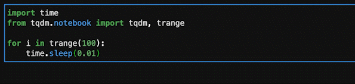

---
tags:
  - Python
---

# Python Jupyter Labでプログレスバーを表示する

大量にデータを読み込んでいる場合など、処理時間が長いと進捗が進んでいるのかどうかを可視化したい

`tqdm`は、Pythonの関数をラップするだけでプログレスバーを表示できるライブラリ

## Install

```
pip install tqdm
```

## Usage

`tqdm`でラップする

```py
from tqdm import tqdm
for i in tqdm(range(10000)):
    ...
```

`range`を`trange`に変更する

```py
import time
from tqdm.notebook import tqdm, trange

for i in trange(100):
    time.sleep(0.01)
```



## Reference
- [tqdm](https://tqdm.github.io/)