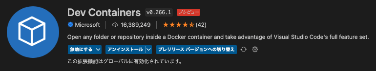
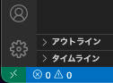
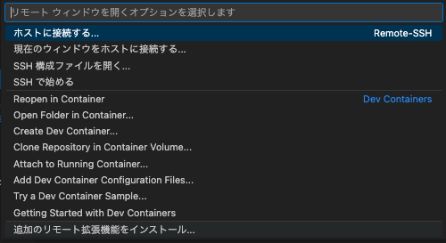

---
tags:
  - Python
  - Docker
---

# Python Dockerコンテナへのリモート接続とデバッグ実行、Jupyter-lab起動

## Topic

Dockerコンテナで開発環境を構築する

- リモート接続
- デバッグの実行
- Jupyter-lab起動

## Usage

VSコードの拡張 `Dev Containers` をインストール



プロジェクトのディレクトリを作成

```
mkdir project_name
```

プロジェクトのディレクトリへ移動し、`.devcontainer`ディレクトリを作成

```
cd project_name
mkdir .devcontainer
```

`.devcontainer`の中に`devcontainer.json`を作成

設定を記述する

```json title="devcontainer.json"
{
	"name": "project name",
	"dockerFile": "Dockerfile",
	"extensions": [
		"ms-python.python"
	]
}
```

`.devcontainer`の中に`Dockerfile`を作成

```DockerFile
FROM python:3

RUN apt-get update
RUN pip install --upgrade pip
RUN python -m pip install jupyterlab
```

`docker-compose`の設定ファイルを作成

```yml
version: '3'
services:
  jupyterlab:
    build: .
    image: jupyterlab-dev-img
    container_name: jupyterlab-dev
    working_dir: /work
    volumes:
      - ./work:/work
    ports:
      - "8888:8888"
    command:
      jupyter-lab --ip 0.0.0.0 --allow-root -b localhost
```

ここまでで以下のようなディレクトリ構成になる

```
/
└── .devcontainer/
　　 ├── devcontainer.json
　　 ├── docker-compose.yml
　　 └── Dockerfile
```

左下の緑色のマークをクリック



Open Folder in Container を選択



作成したディクレトリを選択（今回の場合は`project_name`ディクレトリ）

## Reference
- [Developing inside a Container](https://code.visualstudio.com/docs/devcontainers/containers)
- [Docker Image Python](https://hub.docker.com/_/python)