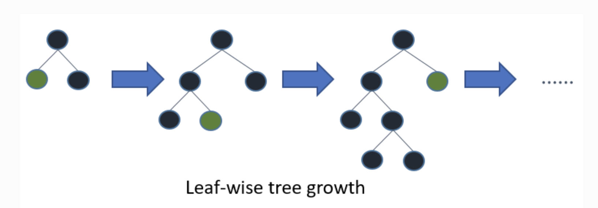

---
tags:
  - Python
  - 機械学習
---

# Python 機械学習ライブラリ LightGBM

## Topic

`LightGBM` (Light Gradient Boosting Machine) について

## Overview

決定木を`Gradient Boosting` (勾配ブースティング)によりアンサンブル学習したもの

- 機械学習におけるツリーベースの分析アルゴリズム
- 教師あり学習によるデータ分析
- 目的変数に応じて説明変数を「分類」する



[source](https://lightgbm.readthedocs.io/en/v3.3.2/Features.html)

## Install

```
pip install lightgbm
```

## Usage
```py
# %%
import lightgbm as lgb
import pandas as pd
import numpy as np
# %%
# scikit-learnからデータ読み込み
from sklearn.datasets import load_wine
data = load_wine()
data
# %%
# Xは特徴量、Yは推論したい値（ターゲット）
X = pd.DataFrame(data['data'], columns=data['feature_names'])
Y = pd.DataFrame(data['target'], columns=['target'])
features = data['feature_names']
# %%
X
# %%
Y
# %%
X.describe()
# %%
# https://scikit-learn.org/stable/modules/generated/sklearn.model_selection.train_test_split.html
# データ全体を、学習に使う訓練用データと検証用データに分割する
from sklearn.model_selection import train_test_split

X_train, X_test, Y_train, Y_test = train_test_split(X, Y, test_size=0.2, random_state=0)
X_train, X_valid, Y_train, Y_valid = train_test_split(X_train, Y_train, test_size=0.2, random_state=0)
len(X_train), len(X_valid), len(X_test)
# %%
train = lgb.Dataset(X_train, label=Y_train)
valid = lgb.Dataset(X_valid, label=Y_valid)
# %%
# パラメーターを設定
params = {
    'boosting_type': 'gbdt',
    'objective': 'multiclass', # 多クラス分類
    'metric': 'multi_logloss',
    'num_class': 3, # 何クラスに分割するか
    'num_iterations': 500, # 決定木の数
    'learning_rate': 0.1
}
# %%
# モデルの学習
model = lgb.train(
    params,
    train,
    num_boost_round=1000,
    early_stopping_rounds=30,
    valid_sets=[train, valid],
    feature_name=features,
    verbose_eval=10
)
# %%
# テストデータを用いて、学習済みモデルによる推論を行う
Y_pred = model.predict(X_test, num_iteration=model.best_iteration)
Y_pred
# %%
# argmaxは、配列の一番大きい値を返す
preds = np.argmax(Y_pred, axis=1)
preds
# %%
# 正解率を確認（推論結果とラベルが同じところをtrueとして合計をとったものを総数で割る）
accuracy = sum(Y_test['target']==preds) / len(Y_test)
accuracy # 0.9166666666666666 => 91%の正解率
```

## Reference
- [LightGBM](https://github.com/microsoft/LightGBM)
- [LightGBM document](https://lightgbm.readthedocs.io/en/v3.3.4/)
- [Python Quick Start](https://lightgbm.readthedocs.io/en/v3.3.4/Python-Intro.html)
- [Python API](https://lightgbm.readthedocs.io/en/v3.3.4/Python-API.html)
- [LightGBM Python-package](https://github.com/microsoft/LightGBM/tree/master/python-package)