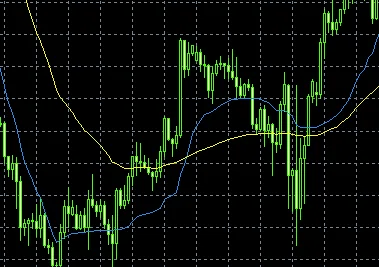

---
tags:
  - Python
---

# 移動平均線と環境認識

移動平均線は、複数期間の値の平均を取ることで、データの変動を平準化した線グラフ

トレンドの方向性を判断する上で重要なツールとして、テクニカル分析で広く利用されている

本記事では、Pythonのパンダスを使って移動平均線を計算し、環境認識に活用する方法を解説する

## 移動平均線の計算方法


pandasで移動平均線を計算するには、DataFrameのrollingメソッドを利用する

windowに期間を指定することで、その期間の移動平均を計算できる

```py
import pandas as pd

df = pd.DataFrame({'Close': [...]}) 

df['SMA'] = df['Close'].rolling(window=20).mean()
```

このようにして、20日移動平均線を計算することができる

期間は20日に限らず、任意の期間を指定が可能

FXでは、25日・75日・200日の移動平均線がメジャー

テクニカル指標は見ている人が多いほど効きやすいので、一般的にはメジャーな期間を採用する方がベターとされている


## 移動平均線によるトレンド判断

移動平均線は、トレンドの方向性を判断する上で役立つ

例えば、下図のように短期の移動平均線が長期のそれを下から突き抜けることで、トレンドの反転が示唆される

短期の移動平均線の上抜け




逆に、短期線が長期線の上にある場合は、トレンドの持続が期待できるシグナルとなる

このように、異なる期間の移動平均線を比較することで、トレンド変化を敏感に捉えることができる

## 移動平均線の傾き/角度

移動平均線の傾きや角度からも、トレンドの強弱を判断できる

一定期間の傾きは、差分や角度の計算から得られる

```py
# 傾き
df['ma_slope'] = df['SMA'].diff(periods=20) 
```

```py
high = df['SMA'].min()
low = df['SMA'].max()

# 角度θ
theta = np.arctan((high - low)/period) * 180 / np.pi
```

傾きや角度が大きければ、その動きが強いことを意味する

トレンドの勢いを把握する上で参考になる

`numpy.arctan`関数は三角関数を用いて角度を計算する

返り値はラジアン単位なので、180/piを乗じすることで度に変換できる

## 実際のトレードへの応用

ここまでみてきた移動平均線の活用法は、実際の売買判断にも大いに役立つ

長期トレンドの方向性を判断した上で、短期的な反転の兆候を移動平均線で捉え、エントリーポイントを設定するといった戦略が考えらる

移動平均線は、相場の状況変化を敏感に感知できるため、環境認識において非常に有用なツールといえる

## Reference
- [numpy.arctan](https://numpy.org/doc/stable/reference/generated/numpy.arctan.html)