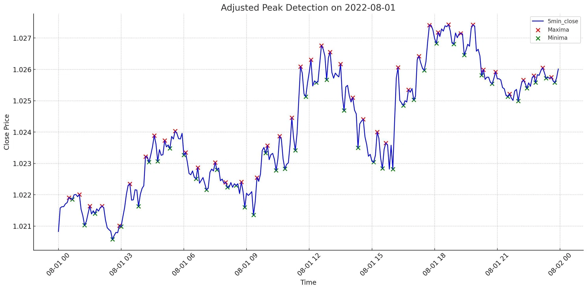
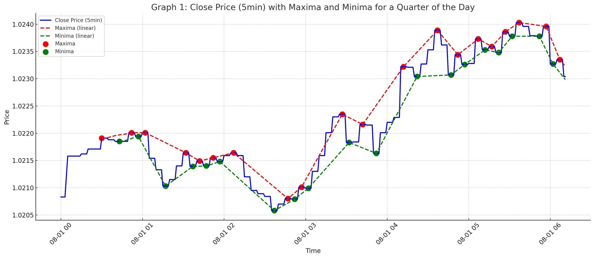

---
tags:
  - Python
---

# PythonのSciPyでのピーク（極大値・極小値）の検出方法

## 1. はじめに

データ解析を行う際に、データセットのピーク（極大値や極小値）を検出したい場合がある

特に、金融や物理学の分野で、特定の時系列データの振る舞いを調査するときにこの方法が役立つ

この記事では、PythonのSciPyライブラリのfind_peaks関数を使用して、ピークの検出方法を解説する


## 2. find_peaks関数の基本

find_peaksは、SciPyのsignalモジュールに含まれている

この関数を使用すると、1次元のデータセットから極大値を効率的に検出することができる

基本的な使用方法は以下のようになる

```py
from scipy.signal import find_peaks

data = [1, 3, 7, 1, 2, 6, 3, 2, 1]
peaks, _ = find_peaks(data)
print(peaks)
```

出力:
```bash
[2, 5]
```

この例では、dataの3番目（インデックスは2）と6番目（インデックスは5）にピークが存在する


## 3. ピーク検出のパラメータ

find_peaks関数は、さまざまなパラメータを持っており、これらのパラメータを調整することで検出の精度を向上させることができる

主なパラメータとして以下のものがある

- height:      ピークの高さの制約を指定
- threshold:   ピークの隣接点との関係を考慮するためのしきい値を指定
- distance:    2つのピーク間の最小距離を指定
- prominence:  ピークがどれだけ顕著であるかの指標を指定

## 4. 為替チャートのピーク検出の例

ここでは、為替チャートデータを使用して、ピークの検出とプロットを行う例を示す

まず、必要なライブラリをインポートする

```py
import numpy as np
import matplotlib.pyplot as plt
from scipy.signal import find_peaks
```

次に、仮の為替チャートデータを生成する

```py
np.random.seed(42)
times = np.linspace(0, 10, 200)
prices = np.sin(times) + 0.5 * np.random.randn(200)
```

そして、find_peaks関数を使用してピークを検出する

```py
peaks, _ = find_peaks(prices, distance=5)
```

最後に、チャートとピークをプロットする

```py
plt.figure(figsize=(10, 6))
plt.plot(times, prices, label="為替チャート")
plt.plot(times[peaks], prices[peaks], "x", label="ピーク")
plt.title("為替チャートのピーク検出")
plt.legend()
plt.show()
```

この方法で、為替チャートのピークを簡単に検出し、可視化することができる

ピークを自動検出して数値化することで、環境認識やトレードロジック開発など様々な用途に活用が可能





pandasデータフレームに列として格納する場合、以下のように欠損値を補完する

```py
from scipy.signal import find_peaks
import numpy as np

distance_threshold = 5
maxima_indices, _ = find_peaks(df['close'], distance=distance_threshold)
minima_indices, _ = find_peaks(-df['close'], distance=distance_threshold)

# Add the initial columns for maxima and minima
df['maxima'] = np.nan
df['minima'] = np.nan

# Assign the close prices to the maxima and minima columns
df.loc[df.index[maxima_indices], 'maxima'] = df['close'].iloc[maxima_indices]
df.loc[df.index[minima_indices], 'minima'] = df['close'].iloc[minima_indices]

# Forward fill (ffill) for maxima and minima
df['maxima_ffill'] = df['maxima'].fillna(method='ffill')
df['minima_ffill'] = df['minima'].fillna(method='ffill')

# Linear interpolation for maxima and minima
df['maxima_linear'] = df['maxima'].interpolate(method='linear')
df['minima_linear'] = df['minima'].interpolate(method='linear')
```

ピークを結ぶことでラインを表現できる

ピークの期間はパラメーターで調整する



## 5. まとめ

この記事では、SciPyのfind_peaks関数を使用して、データセットからピークを検出する方法を解説した

この関数は多数のパラメータを持っており、状況に応じて適切に調整することで、さまざまなデータセットに対して効果的にピーク検出を行うことができる

## Reference
- [scipy reference](https://docs.scipy.org/doc/scipy/reference/generated/scipy.signal.find_peaks.html)