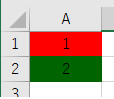
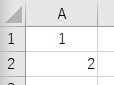

---
tags:
  - VBA
---

# Excel VBA セルの背景色を変更する

## Usage
セルの背景色を変更するには`Range.Interior.ColorIndex`に数字を振るか<br>
`Range.Interior.ColorIndex`にRGBで指定する

```VBScript

Sub sample_Color()

    ' 1
    Cells(1, 1).Interior.ColorIndex = 3

    ' 2
    Cells(2, 1).Interior.Color = RGB(0, 100, 0)

End Sub
```
色を戻すには、無色の`0`を振るか、`ClearFormats`で書式をクリアする
```VBSCript
Sub sample_Color_Clear()

    ' 1
    Cells(1, 1).Interior.ColorIndex = 0

    ' 2
    Cells(2, 1).ClearFormats

End Sub
```


`ClearFormats`の場合は、書式が削除される<br >
中央揃えなども消えていることが確認できる



## Reference
[Interior.Color プロパティ (Excel)](https://docs.microsoft.com/ja-jp/office/vba/api/excel.interior.color)
[ColorIndex プロパティ (Excel グラフ)](https://docs.microsoft.com/ja-jp/office/vba/api/excel.colorindex)
[RGB 関数](https://docs.microsoft.com/ja-jp/office/vba/language/reference/user-interface-help/rgb-function)
[Range.ClearFormats メソッド (Excel)](https://docs.microsoft.com/ja-jp/office/vba/api/excel.range.clearformats)
