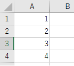
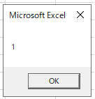
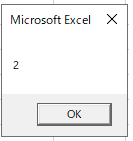
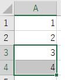

---
tags:
  - VBA
---

# Excel VBA セルを指定する

## Cells

`Cells`も`Range`と同様にセルを指定できる<br>
`Worksheets("Sheet1").Cells(2, 1)`のように、`Cells(行, 列`)と指定する<br>
`Cells(1, "A")`のような書き方もできる

## Range

`Range`はセルや、行、列などを範囲で指定できる<br>
`Worksheets("Sheet1").Range("A1")`とセルを指定したり、`Range("A1:H8").Select`と範囲で指定する<br>
`Range(Cells(1, 2), Cells(3, 4))`と範囲を`Cells`を使って表現することも可<br>

## Usage
```VBScript
Sub sample_Range_Cells()

    Dim ws As Worksheet
    Set ws = Worksheets("sheet1")

    MsgBox ws.Range("A1").Value

    MsgBox ws.Cells(2, 1).Value

    ws.Range(ws.Cells(3, 1), ws.Cells(4, 1)).Select

End Sub
```


サンプルでは、順番にメッセージボックスに1、2と表示され、



A1のセルの値をメッセージボックスに表示



A2のセルの値をメッセージボックスに表示

最後に、セル範囲が選択状態になる



A3:A4のセルを選択

## Reference
[Worksheet.Cells プロパティ (Excel)](https://learn.microsoft.com/ja-jp/office/vba/api/excel.worksheet.cells)<br>
[Range オブジェクト (Excel)](https://docs.microsoft.com/ja-jp/office/vba/api/excel.range(object))<br>
