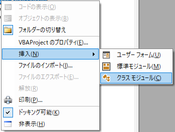

---
tags:
  - VBA
---

# Excel VBA クラスを定義する

- VBAでクラスを定義し、使用する方法

## Usage

クラスモジュールを作るには、挿入 -> クラスモジュールを選択



```VBScript
Option Explicit


```

クラスを呼び出し、使用する

```VBScript

```

## Reference
- [宣言されている VBA プロジェクトの外部からクラス (オブジェクト) を使用する方法](https://learn.microsoft.com/ja-jp/previous-versions/office/troubleshoot/office-developer/set-up-vb-project-using-class)