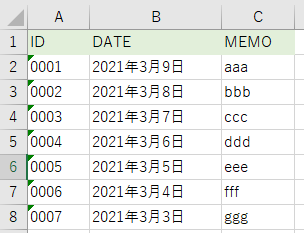
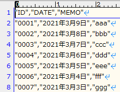

---
tags:
  - VBA
---

# Excel VBA シートの値をCSVとして書き出す

このようなシートを想定<br>


## Usage
```VBScript
Sub sample_exportCsv()

    Dim ws As Worksheet
    Dim savePath As String
    Dim fileNo As String
    Dim end_row As Long
    Dim start_row As Long
    Dim start_col As Long
    Dim end_col As Long
    Dim headers As String
    Dim data As String

    savePath = ThisWorkbook.Path & "\test.csv"

    Set ws = Worksheets("Sheet1")
    end_row = ws.Cells(Rows.Count, 1).End(xlUp).row

    ' フリーファイル番号を割り当て
    fileNo = FreeFile
    Open savePath For Output As #fileNo

    ' ヘッダー ======================================
    For start_col = 1 To 3
        headers = headers & ",""" & ws.Cells(1, start_col).Value & """"
    Next

    headers = Replace(headers, ",", "", 1, 1)
    Print #fileNo, headers

    ' データ =======================================
    For start_row = 2 To end_row

        data = ""

        For start_col = 1 To 3
            data = data & ",""" & ws.Cells(start_row, start_col).Value & """"

        Next

        data = Replace(data, ",", "", 1, 1)
        Print #fileNo, data

    Next

End Sub


```

出力結果のCSVは、このようになる<br>


## Reference
[FreeFile 関数](https://learn.microsoft.com/ja-jp/office/vba/language/reference/user-interface-help/freefile-function)<br>
[Print # ステートメント](https://learn.microsoft.com/ja-jp/office/vba/language/reference/user-interface-help/printstatement)<br>
