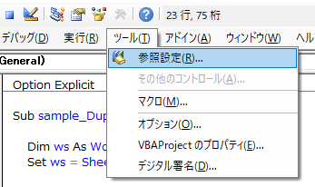
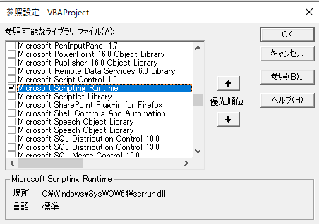
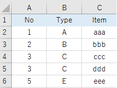
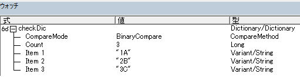

---
tags:
  - VBA
---

# Excel VBA 複合キーの重複行をチェックしてメッセージを表示する

Excel VBA で表にある複数列からなるキー項目に、重複チェックをする方法

## Dictionary

データを「キー・アイテム」のペアで格納できるオブジェクト<br>

他言語でいうところの、`Key`・`Value`で格納できる連想配列<br>

`Dictionary`のメソッドである`Exists`メソッドで重複をチェックに利用する

## Usage
```VBScript
Sub sample_Duplicate_2()

    Dim ws As Worksheet
    Set ws = Sheets("Sheet5")

    ' 参照設定 → microsoft scripting runtime を有効にしておく
    Dim checkDic   As Dictionary
    Set checkDic = New Dictionary

    Dim key As String
    Dim i As Long

    For i = 2 To 6

        ' 複合キー
        key = ws.Cells(i, 1) & ws.Cells(i, 2)

        If checkDic. Exists(key) Then
            MsgBox "KEY項目が重複しています。"
        Else
            checkDic.Add key, 0
        End If

    Next

End Sub
```

`Dictionary`を使用するには、参照設定で`Microsoft Scripting runtime`を有効にする必要がある



メニューの参照設定から`Microsoft Scripting runtime`を選択



サンプルでは、4行目と5行目が重複している



ループのなかで`Dictionary`の`Key`として値が順番に格納されていることがウォッチから確認できる



同じ`key`が存在した時点で、エラーメッセージが表示される

## Reference
[Dictionary オブジェクト](https://docs.microsoft.com/ja-jp/office/vba/language/reference/user-interface-help/dictionary-object)<br>
[Exists メソッド](https://docs.microsoft.com/ja-jp/office/vba/language/reference/user-interface-help/exists-method)<br>
[オブジェクト (Visual Basic for Applications)](https://learn.microsoft.com/ja-jp/office/vba/language/reference/objects-visual-basic-for-applications)<br>
