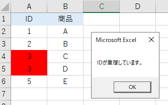

---
tags:
  - VBA
---

# Excel VBA 重複行をチェックしてエラーメッセージを出す

Excel VBAでセルのある値をレコードのKEY項目としている場合、重複しているかどうかをチェックしたい時がある<br>

重複しているかどうかは、Excelの`CountIf`関数が使える

## CountIf
指定された範囲に含まれるセルのうち、検索条件に一致するセルの個数を返すメソッド<br>
WorksheetFunction.CountIf メソッド (Excel)の`CountIf(検索範囲, 検索対象)`と引数を指定する<br>

重複を調べるには、列を全て検索して値が同じものが１つ以上あるかを調べればOK

## Usage
```VBScript
Sub sample_Duplicate()

    Dim ws As Worksheet
    Set ws = Sheets("Sheet2")
    Dim i As Long

    For i = 2 To 6

        If WorksheetFunction.CountIf(Columns(1), ws.Cells(i, 1)) > 1 Then
                MsgBox "IDが重複しています。"
                ws.Cells(i, 1).Interior.ColorIndex = 3
        End If

    Next

End Sub

```



サンプルでは、各行で「一意キーであるべきID」の重複をチェックして、重複していればメッセージを表示し、背景色を変更している

## Reference
[Application.WorksheetFunction プロパティ (Excel)](https://docs.microsoft.com/ja-jp/office/vba/api/excel.application.worksheetfunction)<br>
[WorksheetFunction.CountIf メソッド (Excel)](https://docs.microsoft.com/ja-jp/office/vba/api/excel.worksheetfunction.countif)<br>
