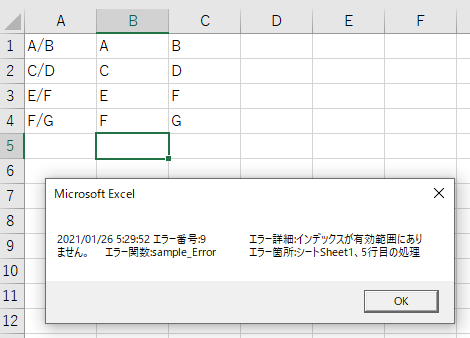

---
tags:
  - VBA
---

# Excel VBA エラーを処理する

VBAのエラーハンドリングについて<br>

Excel VBAでは、他の言語のような`Try-catch`の機能はないが<br>
`Go to`を使って誘導したり、処理を変えたりすることは可能

## On Error Go To

`On Error Go To`の後に続く「引数」を用意し、`引数：`の後にエラー発生時の処理を記述する<br>

## Usage
```VBScript
Sub sample_Error()

    Dim functionName As String
    functionName = "sample_Error"

    Dim ws As Worksheet
    Set ws = Sheets("Sheet1")

    Dim str() As String
    Dim i As Long

    ' エラーを処理したい部分に宣言
    On Error GoTo Error

    For i = 1 To 5

        str = Split(ws.Cells(i, 1), "/")
        ws.Cells(i, 2) = str(0)
        ws.Cells(i, 3) = str(1)

    Next

' 正常の場合、Exit で処理が終了
Exit Sub

' エラー発生の場合の処理
Error:
    MsgBox(Now & vbTab & _
                    "エラー番号:" & Err.Number & vbTab & _
                    "エラー詳細:" & Err.Description & vbTab & _
                    "エラー関数:" & functionName & vbTab & _
                    "エラー箇所:" & "シート" & ActiveSheet.Name & "、" & i & "行目の処理")

    End ' 全体の処理を止めたい場合は「End」
End Sub
```

5行目でエラーが出るようにサンプルを用意<br>
実行すると、エラー発生時にメッセージボックスに詳細がでる<br>



ログに出力するようにすると、保守のしやすさもアップする<br>
呼び出し元も含めて全ての処理止めたい場合は、`End`を用いる<br>

## Errオブジェクト

Errオブジェクトには、エラー発生時の様々な情報が格納される<br>

|プロパティ|説明|
|-------|-------|
|Number|エラー番号|
|Description |エラー詳細|

他にもあるが、上の2つをおさえていれば十分

## Reference
[GoTo ステートメント](https://learn.microsoft.com/ja-jp/office/vba/language/reference/user-interface-help/goto-statement)<br>
[On Error ステートメント](https://docs.microsoft.com/ja-jp/office/vba/language/reference/user-interface-help/on-error-statement)<br>
[Err オブジェクト](https://docs.microsoft.com/ja-jp/office/vba/language/reference/user-interface-help/err-object)<br>
[End ステートメント](https://learn.microsoft.com/ja-jp/office/vba/language/reference/user-interface-help/end-statement)<br>
