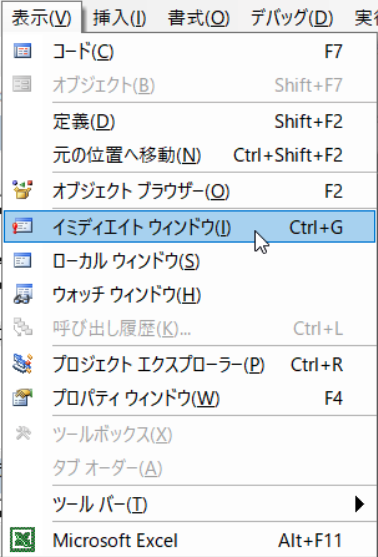
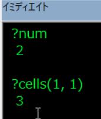
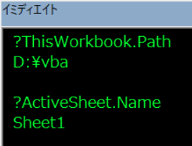
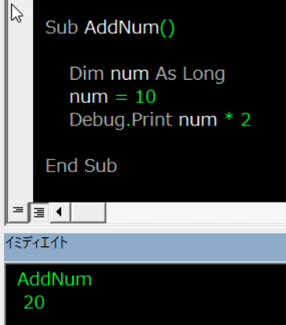

---
tags:
  - VBA
---

# Excel VBA イミディエイトウィンドウの活用

Excel VBAで変数やプロパティの値を調べたいときは、イミディエイトウィンドウを活用できる

```VBScript
?num
2

?cells(1, 1)
3
```

## イミディエイトウィンドウの開き方

メニューの表示から、イミディエイトウィンドウを開く<br>

ショットカットは、`Ctrl + G`



## Usage

デバッグ中に変数や値を調べるには、`?変数名`を入力する



セルや変数だけでなく、アクティブなオブジェクト等、様々な調べたいときに使える

```VBScript
?ThisWorkbook.Path
D:¥vba

?ActiveSheet.Name
Sheet1
```



イミディエイトウィンドウでプロシージャを実行することも可



カレントモジュールでないプロシージャであっても、<br>
`Module1.AddNum`（モジュール名.プロシージャ名）とすれば実行できる<br>
引数をもつ`Function`でもOK


## Reference
[イミディエイト ウィンドウを使用する](https://learn.microsoft.com/ja-jp/office/vba/language/reference/user-interface-help/use-the-immediate-window)<br>
[[イミディエイト] ウィンドウ](https://learn.microsoft.com/ja-jp/office/vba/language/reference/user-interface-help/immediate-window)<br>
