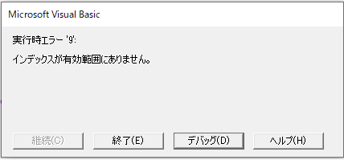

---
tags:
  - VBA
---

# Excel VBA 「インデックスが有効範囲にありません」エラー

Excel VBAの「インデックスが有効範囲にありません」エラーへの対処法<br>
このエラーは、存在しない範囲のオブジェクトを操作したときに発生する

## 発生例
```VBScript
Sub sample_error_index()

    Dim ws As Worksheet
    Set ws = Worksheets("sheet7")

    MsgBox ws.Name

End Sub
```


存在しない「Sheet7」を表示しようとして、エラーが発生する<br>

このエラーが発生した場合は、

- 指定したオブジェクトが存在しているか？
- 配列の範囲外を指定していないか？

などを確認する

## Reference
[インデックスが有効範囲にありません。 (Visual Basic)](https://docs.microsoft.com/ja-jp/dotnet/visual-basic/language-reference/error-messages/subscript-out-of-range)
