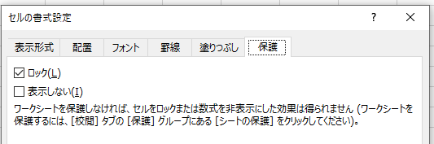

---
tags:
  - VBA
---

 # Excel VBA セルのロックを解除する

シートを保護すると、ロックにチェックマークが入っているセルが保護される<br>


このとき、特定のセルだけは条件によってロックを外したい場合がある

## Locked
`Range`オブジェクトに対して`Locked`プロパティを操作して、ロックの設定を変更することができる

## Usage
```VBScript
Sub sample_Locked()

  Dim ws As Worksheet
  Set ws = Worksheets("sheet1")

  ' ロックを解除
  ws.Range("A1").Locked = False

End Sub
```

注意点：シートの保護をする前にロックの解除を行う必要がある

## Reference
[Range.Locked プロパティ (Excel)](https://docs.microsoft.com/ja-jp/office/vba/api/excel.range.locked)<br>
