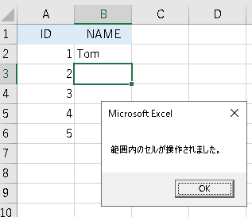

---
tags:
  - VBA
---

# Excel VBA 特定セルへの入力を検知してマクロを実行する

## Worksheet_Change
ワークシートのセルがユーザーまたは外部リンクにより変更されたときに発生する<br>
シートの中にコードを書くと、シートの指定したセル範囲の`Range`を引数として受け取る

## Intersect
引数に渡した`Range`の共通範囲を検知するメソッド<br>
2つ以上の範囲の長方形の交差を表す`Range`オブジェクトを返す<br>
別のワークシートの1つ以上の範囲が指定されている場合は、エラーが返される

## Usage
```VBScript
Option Explicit

Private Sub Worksheet_Change(ByVal Target As Range)

    ' 指定したセル範囲でなければ、True となり何もしない
    If Intersect(Target, Range("B1:B6")) Is Nothing Then
        Exit Sub
    Else
        MsgBox "範囲内のセルが操作されました。"
    End If

End Sub
```
サンプルでは`B1:B6`の範囲が操作されたら、メッセージを表示している<br>
<br>

公式ドキュメントのWorksheetイベントの例が参考になる

## Reference
[Worksheet.Change イベント (Excel)](https://docs.microsoft.com/ja-jp/office/vba/api/excel.worksheet.change)<br>
[Application.Intersect メソッド (Excel)](https://docs.microsoft.com/ja-jp/office/vba/api/excel.application.intersect)<br>
