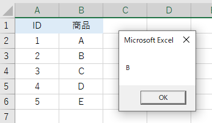

# Excel VBA で検索した値の隣のセルの値を取得する

## Find
指定したセル範囲の情報を取得する<br>
一致するデータが見つからなかった場合は `Nothing` を返す<br>

`Set rng = Worksheets(1).Range("A1:A500").Find("検索値") `

処理も早いので重宝するメソッド<br>

## Offset
引数に渡したセル数だけ、移動したセルを取得する<br>

`Range("A1").Offset(0, 3).Select`

## Usage
```VBScript
' 引数にセル範囲・検索値を受け取って、取得した隣のセルの値を返す
Function sample_find(check_range As Range, id As Long) As String

    Set check_range = check_range.Find(id)

    If check_range Is Nothing Then
      Exit Function
    Else
       sample_find = check_range.Offset(0, 1).Value
    End If

End Function

' 実行
Sub sample_test()

    Dim rng As Range
    Set rng = Range("A2:A6")

    Dim str As String

    ' ここで上のファンクションを実行
    str = sample_find(rng, 2)
    MsgBox str

End Sub

```
サンプルでは、`sample_find`ファンクションが、セル範囲と検索値を引数に受け取っている<br>


`sample_test`で実行すると、検索した値の隣のセルの値がメッセージに表示される

## Reference
[Range.Find メソッド (Excel)](https://docs.microsoft.com/ja-jp/office/vba/api/excel.range.find)<br>
[Range.Offset プロパティ (Excel)](https://docs.microsoft.com/ja-jp/office/vba/api/excel.range.offset)<br>
