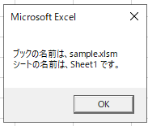

---
tags:
  - VBA
---

# Excel VBA ブックやシートを変数に格納する

Excel VBAでブックやシートを扱いたい場合、まず変数に格納する必要がある<br>
実務では「あるブックのシートから、他のブックのシートに転記したい」という場合がよくある

## コレクションオブジェクト
ブックやシートは、コレクションと呼ばれるオブジェクト型のデータ<br>

他のデータ型と異なり、`Set A = B`という形で変数に格納する

## Usage
```VBScrit
Sub sample_Collection()

    Dim wb As Workbook
    Set wb = Workbooks("sample.xlsm")

    Dim ws As Worksheet
    Set ws = Worksheets("Sheet1")

    MsgBox "ブックの名前は、" & wb.Name & vbCrLf & _
                 "シートの名前は、" & ws.Name & " です。"

End Sub
```


ブックとシートを変数に入れて表示

## Reference
[Workbook オブジェクト (Excel)](https://docs.microsoft.com/ja-jp/office/vba/api/excel.workbook)<br>
[Worksheet オブジェクト (Excel)](https://docs.microsoft.com/ja-jp/office/vba/api/excel.worksheet)<br>
[オブジェクト モデル (Excel)](https://learn.microsoft.com/ja-jp/office/vba/api/overview/excel/object-model)<br>
