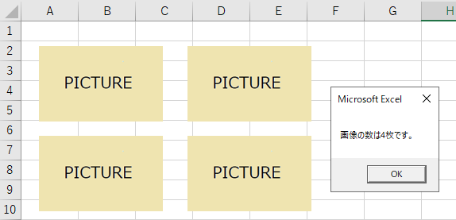

---
tags:
  - VBA
---

# Excel VBA シートの画像の数をカウントする

Excel VBAでシート上に画像の数が何枚あるかを調べたい時に使う方法

## Usage

```VBScript
Sub sample_ShapeCount()

    Dim ws As Worksheet
    Set ws = Sheets("Sheet3")

    Dim shp As Shape
    Dim cnt As Long

    ' 画像の数を取得
     For Each shp In ws.Shapes
        If shp.Type = 13 Then ' 画像タイプで判定
            cnt = cnt + 1
        End If
    Next

    MsgBox "画像の数は" & cnt & "枚です。"

End Sub
```

`type = 13`は、`shape`のタイプが画像であれば`True`になるように指定している<br>

図形の数を調べるなら、`type = 1`と数値を変更すればOK<br>



調べたい画像のタイプについては、公式ドキュメント「[MsoShapeType 列挙 (Office)](https://docs.microsoft.com/ja-jp/office/vba/api/office.msoshapetype)」にてプロパティ一覧を確認

## Reference
[Shape オブジェクト (Excel)](https://docs.microsoft.com/ja-jp/office/vba/api/excel.shape)<br>
[MsoShapeType 列挙 (Office)](https://docs.microsoft.com/ja-jp/office/vba/api/office.msoshapetype)<br>
