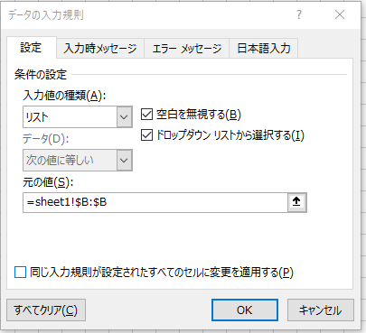

---
tags:
  - VBA
---

# Excel VBA 複数のシートを一括でコピーする

入力規則を参照によって設定している場合、参照元のシートを同時にコピーしないと参照が外れる



複数のシートを一括でコピーするには、配列を使う

## Usage
```VBScript
Sub copyWorkSheets()

        Dim i As Long : i = 0

        Dim ArraySheets() As String
        ReDim ArraySheets(0)

        Dim ws As Worksheet
        For Each ws In ThisWorkbook.Worksheets

            ReDim Preserve ArraySheets(i)
            ArraySheets(i) = ws.Name
            i = i + 1

        Next

        ThisWorkbook.Worksheets(ArraySheets).Copy Before:=ThisWorkbook.Worksheets("sheet1")

End Sub
```

## Reference
* [ReDim ステートメント](https://learn.microsoft.com/ja-jp/office/vba/language/reference/user-interface-help/redim-statement)
* [Worksheets.Copy メソッド (Excel)](https://learn.microsoft.com/ja-jp/office/vba/api/excel.worksheets.copy)
* [Application.ThisWorkbook プロパティ (Excel)](https://learn.microsoft.com/ja-jp/office/vba/api/excel.application.thisworkbook)
