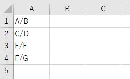
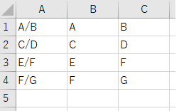

---
tags:
  - VBA
---

# Excel VBA 文字列を分割する

Excel VBA で文字列を分割したい場合は、`Split`関数を使う

## Split

`Split`関数は、引数で渡された文字列を、指定した文字で分割するメソッド<br>
返り値は「配列」<br>
`( )`で返り値を格納する変数を用意する

## Usage

```VBScript
Sub sample_split()

    Dim ws As Worksheet
    Set ws = Sheets("Sheet1")

    Dim str() As String
    Dim i As Long

    For i = 1 To 4

        str = Split(ws.Cells(i, 1), "/")
        ws.Cells(i, 2) = str(0)
        ws.Cells(i, 3) = str(1)

    Next

End Sub

```

Splitの実行前<br>


サンプルでは、`/`で分割するように引数に渡している<br>

Splitの実行後<br>


第一引数に空白セルを渡すと「インデックス範囲が有効範囲にありません。」とエラーになるので注意

## Reference
[分割関数](https://docs.microsoft.com/ja-jp/office/vba/language/reference/user-interface-help/split-function)
