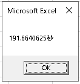

# Excel VBA プロシージャの処理時間を計測する

## Timer
`Timer`は、午前 0 時からの経過秒数を表す<br>
「単精度浮動小数点数型 (Single) 」の値を返す

## Usage

```VBScript
Sub sampler_Timer()

     Dim startTime As Double
     Dim stopTime As Double
     Dim duration As Double
     Dim i As Long

     ' スタート
     startTime = Timer

     For i = 1 To 5000
        Cells(i, 1) = "sample"
     Next i

     ' ストップ
     stopTime = Timer

     ' 所要時間
     duration = stopTime - startTime
     MsgBox duration & "秒"

End Sub
```


## Reference
[タイマー関数](https://docs.microsoft.com/ja-jp/office/vba/language/reference/user-interface-help/timer-function)
