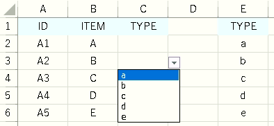

---
tags:
  - VBA
---

# Excel VBAでセルに入力規則を設定する

## Validation
指定した引数`Range`に対して、入力規則を設定できる<br>
`Add`以下でパラメーターによって方法を指定<br>

## Usage
```VBScript
Sub sample_Validation()

    Dim ws As Worksheet
    Set ws = Worksheets("Sheet3")

    Dim target As Range
    Set target = ws.Range("C2:C6")

    With target.Validation
            .Delete
            .Add Type:=xlValidateList, _
                Operator:=xlEqual, _
                Formula1:="=$E$2:$E$6"
    End With

End Sub
```

サンプルでは、`C3:C6`の範囲に対して、`E3:E6`の範囲を入力規則として設定<br>
各パラメーターについての詳細は、公式ドキュメントのリンクを確認<br>


## Reference
[Validation.Add メソッド (Excel)](https://docs.microsoft.com/ja-jp/office/vba/api/excel.validation.add)<br>
[Validation オブジェクト (Excel)](https://docs.microsoft.com/ja-jp/office/vba/api/excel.validation)<br>
[XlDVType 列挙 (Excel)](https://docs.microsoft.com/ja-jp/office/vba/api/excel.xldvtype)<br>
[XlFormatConditionOperator 列挙 (Excel)](https://docs.microsoft.com/ja-jp/office/vba/api/excel.xlformatconditionoperator)<br>
